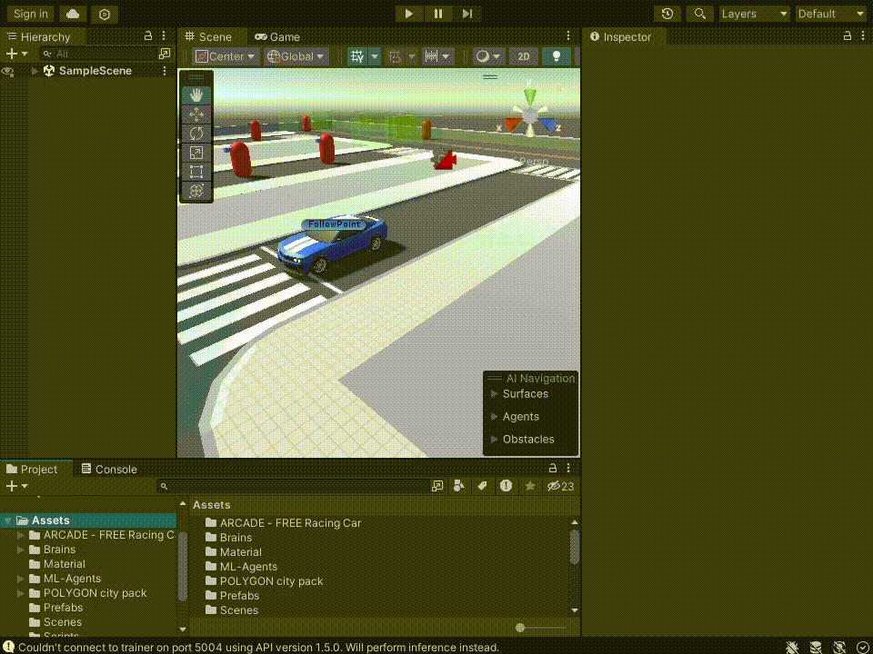
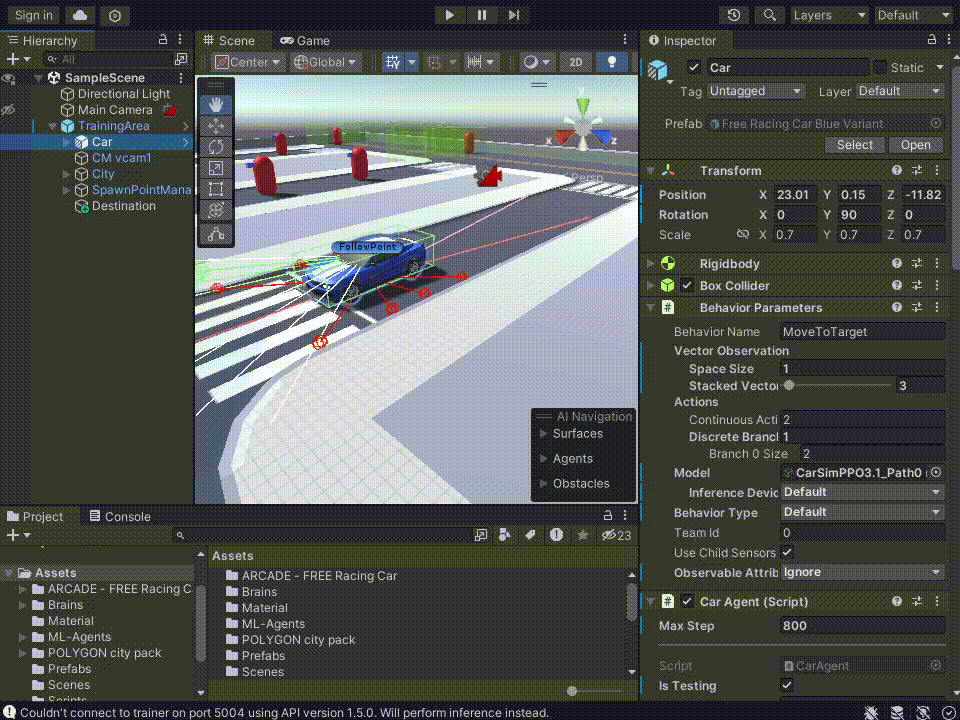

# Plataforma de treinamento de AI para veículos autônomos

Este repositório é um projeto feito na game engine da Unity3D criado como um PGC - Projeto de Graduação em Computação (TCC) do curso de Ciência da Computação na UFABC (Universidade Federal do ABC). Seu propósito é ser uma plataforma que sirva de treinamento para veículo autônomos, a dissertação original do projeto se encontra [neste repositório](https://github.com/antunesvitor/pgc-bcc-simulador-conducao-autonoma), mais especificamente o arquivo dissertacao.pdf, um artigo cobrindo o desenvolvimento inicial deste projeto e as primeiras análises/estudos sobre o mesmo.

Abaixo se encontra instruções de como reproduzir os testes feitos e como treinar seu próprio agente

## Requisitos

- OS: Windows 1¹  ou Linux²
- Unity Hub
- Unity3D editor versão 2022.3.13f1³
- git (opcional)

¹ A Unity3D está disponível para Windows 10 também, mas este projeto não foi testado nele, provavelmente é possível reproduzir/treinar sem problema algum no Win10.

² As versões de Linux suportadas oficialmente é O Ubuntu 16.04, 18.04 e CentOS 7.  O desenvolvimento do projeto foi feito no Arch Linux que NÃO é oficialmente suportado.

³ Pode ser possível executar em outras versões 2022.3.x.

## Como reproduzir
Aqui é explicado como reproduzir os testes que foram feitos no projeto. Eles obterão o exato resultado mostrado no projeto dado a natureza estocástica do agente e grande quantidade de possíveis estados, porém um desempenho muito próximo é esperado.

### Instalando e abrindo o projeto

1. Primeiro baixe e instale o Unity Hub.
    -  Windows: instale pelo [site oficial da Unity](https://unity.com/download).
    -  Arch Linux: instale [o pacote na AUR](https://aur.archlinux.org/packages/unityhub).
        - para isso terá que usar um gerenciador de pacotes da AUR como o [yay](https://github.com/Jguer/yay) ou [o paru](https://github.com/morganamilo/paru).
    - Para as distribuições Linux oficialmente suportadas siga as instruções [clicando aqui](https://docs.unity3d.com/2020.1/Documentation/Manual/GettingStartedInstallingHub.html)

2. Após isso clone este repositório com o comando:

    ```
    git clone https://github.com/antunesvitor/SimuladorDeConducao
    ```

    Ou caso, caso prefira, baixe o .zip e descompacte-o em qualquer pasta.

3. Abra o Unity Hub, vá em Open e navegue até o diretório onde você baixou o projeto e clique abrir. É possível que apareça um aviso de que a versão do editor não está instalada no seu computador, para isso existe duas opções:
    - (Recomendado) Baixar a versão exata do projeto: Vá na [página de arquivo da editores da Unity](https://unity.com/releases/editor/archive) clique na aba "Unity 2022.X" e clique no botão  "Unity Hub" na versão 2022.3.7;
    - (Não recomendado) Alterar a versão do projeto: quando o aviso aparecer clique em "Choose another editor version" e então em "Install Editor Version" ele te apresentará as versões LTS disponíveis para download;

4. Após isso basta clicar duas vezes para abrir o projeto.

### Testando os modelos
Para testar os modelos apropriadaente é preciso testar um por vez e ajustar o projeto de acordo, alguns dos "cérebros" (arquivos .onnx na pasta Brains) são de trajetos específicos.

1. Selecione o objeto Car na hierarquia do projeto.


2. Arraste o "cérebro" que deseja treinar para o campo Model no inspetor à esquerda do editor. (na imagem abaixo ele seleciona o cérebro para o path 0).


3. Desabilite todos os paths que não for usar (no exemplo ele desabilita todos os paths exceto o path 0).


4. Agora basta apertar o botão play &#9654; no topo ao centro e o veículo já estará sendo conduzido pelo cérebro. (Obs. garanta que os campos "Behaviour Type" e "Inference Device" estejam ambos em Default ou "Inference Only" e "CPU" respectivamente, caso contrário não funcionará).


### Nomenclatura dos cérebros
Os "cérebros" estão na pasta Assets/Brains e seguem o seguinte padrão de nome:

```
CarSim<algoritmo><versão>_<path>-<id>
```

\<algoritmo\> serve pra identificar o algoritmo que foi treinado possíveis valores são: PPO, SAC, PPO+BC, PPO+GAIL, PPO+GAIL+BC, etc. 

<versão> é um número que identifica a versão do veículo, durante o projeto diversas versões foram criadas, atualmente só há uma versão dele (3.1), porém esta a versão foi posta para deixar claro que possa haver mais de um agente em versões diferentes no mesmo ambiente.

<path> a rota a qual aquele cérebro treinou, se habilitar uma rota diferente do cérebro ele provavelmente não irá desempenhar bem a tarefa. O nome é igual aos GameObjects do localizados abaixo do GameObject SpawnPointManager. O "GERAL" significa que ele treinou em todas as rotas.

<id> opcional, um identificador a mais para diferenciar um cérebro de outro caso os valores acima sejam iguais.
